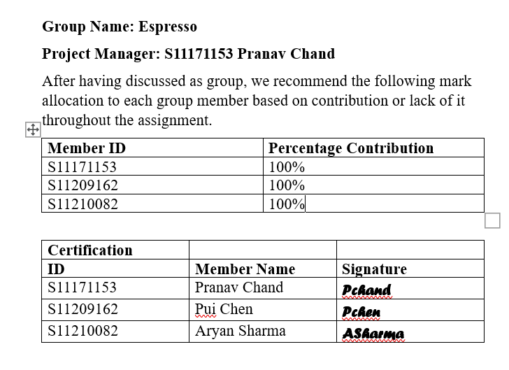

# CS214 Assignment 2

# Algorithms Implemented
## Held-Karp Algorithm
1. **Problem Definition:** Given a complete graph with cities as vertices and distances between cities as edge weights, the objective is to find the shortest Hamiltonian cycle (a cycle that visits every city exactly once and returns to the starting city).  

2. **Dynamic Programming Approach:** Held-Karp uses a dynamic programming approach to solve the TSP efficiently. It leverages the principle of optimality, breaking down the problem into smaller subproblems and building up the optimal solution.  

3. **State Representation:** The algorithm represents the state of the problem using a bitmask. Each bit in the bitmask corresponds to a city, and the presence or absence of a bit indicates whether the city has been visited or not. The bitmask is used to track the subset of cities visited in the current state.  

4. **Recurrence Relation:** The algorithm establishes a recurrence relation to calculate the minimum cost of reaching a state (subset of cities) from any of its possible predecessor states. The recurrence relation considers all possible paths to the current state and selects the one with the minimum cost.  

5. **Memoization:** To avoid redundant calculations, the algorithm uses memoization by storing the computed results in a table. This table is often a 2D array where one dimension represents the subset of cities and the other dimension represents the current city.  

6. **Backtracking:** After computing the optimal tour length, the algorithm backtracks to reconstruct the actual tour by finding the sequence of cities that led to the minimum cost.  

7. **Complexity:** The Held-Karp algorithm has a time complexity of O(n^2 * 2^n), where n is the number of cities. While this complexity is exponential, it is significantly more efficient than the naive approach of checking all possible tours, which has a factorial time complexity.  

**Note:** Despite its efficiency improvements, the Held-Karp algorithm becomes impractical for large numbers of cities due to its exponential time complexity. In practice, heuristics and approximation algorithms are often employed for larger instances of the TSP.  

## Genetic Algorithm

1. **Initialization:**
    - **Population:** Create an initial population of potential solutions (individuals or chromosomes). Each individual represents a possible solution to the problem.

2. **Evaluation:**
    - **Objective Function:** Evaluate the fitness of each individual in the population using an objective function. The objective function quantifies how well an individual solves the problem. It could be a measure of how close the solution is to the optimal one.

3. **Selection:**
    - **Fitness Proportionate Selection:** Individuals with higher fitness have a higher chance of being selected for the next generation. This mimics the idea of "survival of the fittest" in natural selection.

4. **Crossover (Recombination):**
    - **Crossover Operation:** Select pairs of parents based on their fitness and perform crossover to create offspring. Crossover involves exchanging genetic information between two parents to create one or more children.

5. **Mutation:**
    - **Mutation Operation:** Apply random changes to some individuals in the population. Mutation introduces diversity and helps explore new regions of the solution space.

6. **Replacement:**
    - **New Generation:** Form a new generation by combining parents and offspring. This replaces the old population.

7. **Termination:**
    - **Stopping Criterion:** Repeat steps 2 to 6 for a certain number of generations or until a termination criterion is met (e.g., a satisfactory solution is found).

8. **Result:**
    - **Best Solution:** The algorithm returns the best solution found during the run.

### Key Concepts

- **Chromosome/Individual:** Represents a potential solution to the problem. It is encoded in a way that reflects the problem domain.

- **Fitness Function/Objective Function:** Quantifies how well an individual solves the problem. This function guides the search toward better solutions.

- **Selection:** Determines which individuals will be parents for the next generation. Common methods include roulette wheel selection and tournament selection.

- **Crossover (Recombination):** Combines genetic information from two parents to create one or more offspring. Mimics genetic recombination in biology.

- **Mutation:** Introduces random changes to individuals to promote diversity and prevent premature convergence to a suboptimal solution.

- **Population:** The set of all individuals at a particular point in the algorithm. The population evolves over generations.

- **Convergence:** The process by which the population tends to contain increasingly fit individuals as the algorithm progresses.

- **Diversity:** The variety of individuals in the population. Balancing exploration and exploitation is crucial for the success of the algorithm.

# References #
https://www.geeksforgeeks.org/traveling-salesman-problem-using-genetic-algorithm/   
https://medium.com/@becmjo/genetic-algorithms-and-the-travelling-salesman-problem-d10d1daf96a1   
https://www.youtube.com/watch?v=6jqlBDYNrL0   
https://www.youtube.com/watch?v=XaXsJJh-Q5Y   
https://github.com/CarlEkerot/held-karp/blob/master/LICENSE

